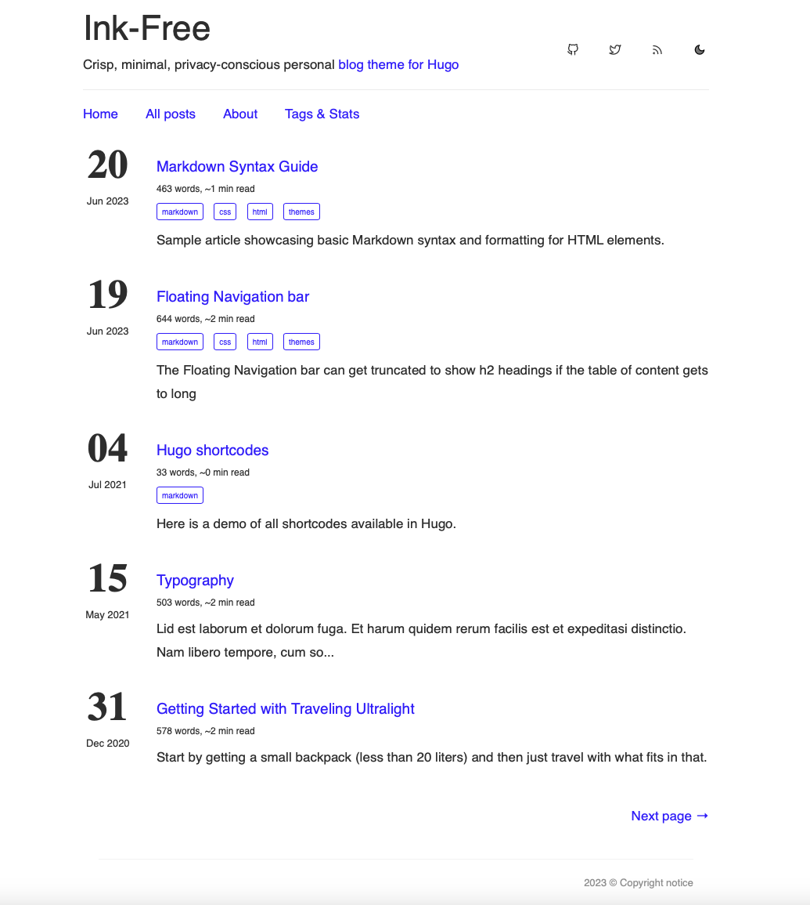
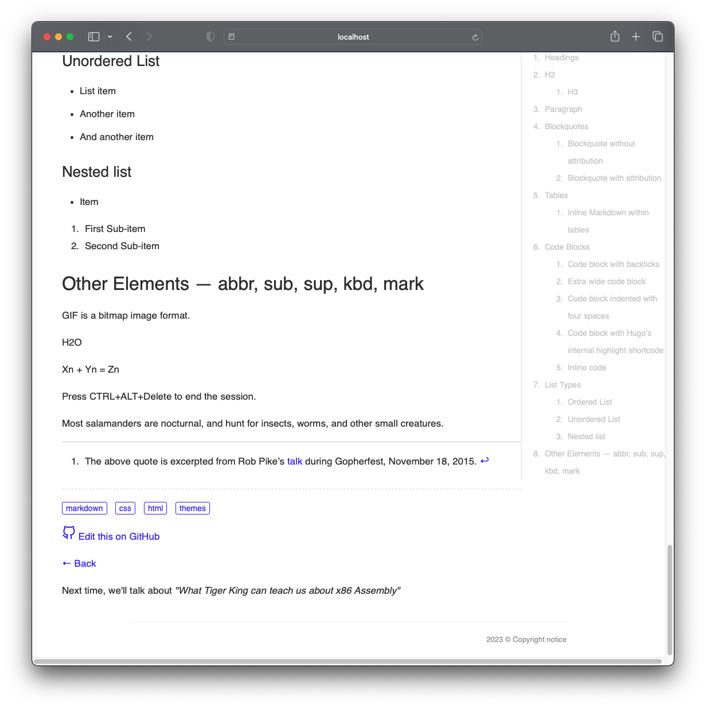
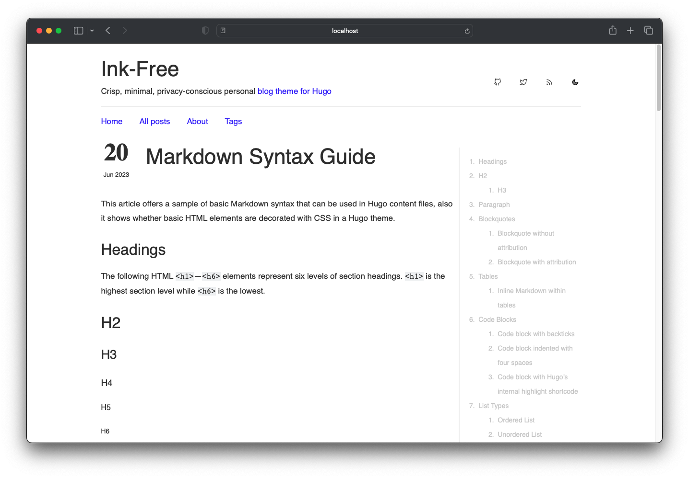
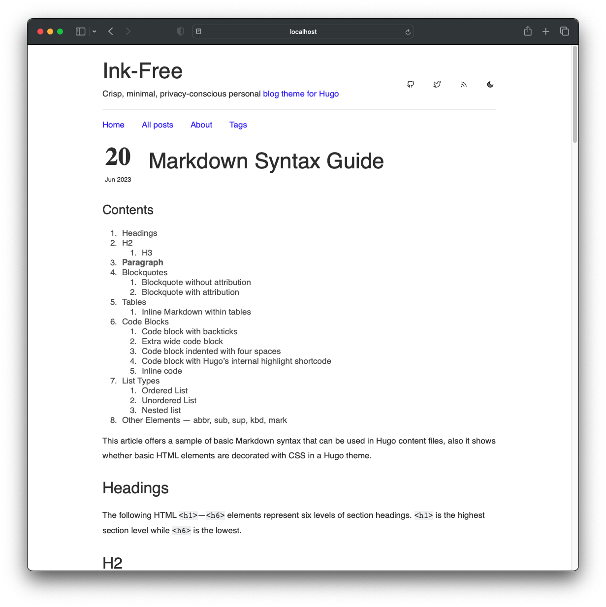
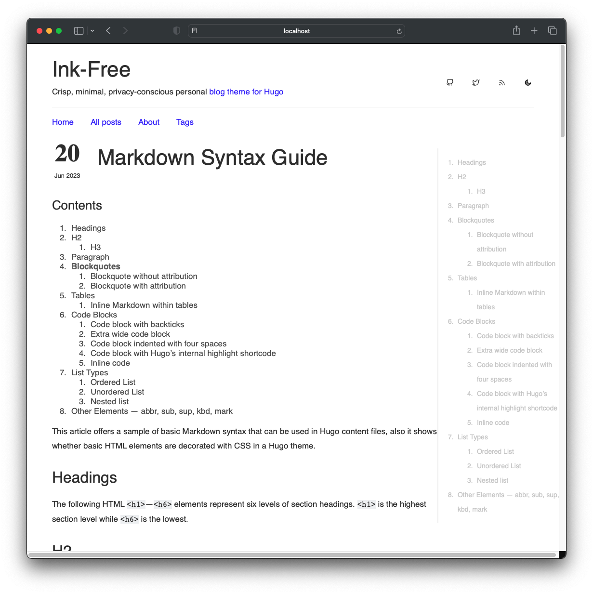
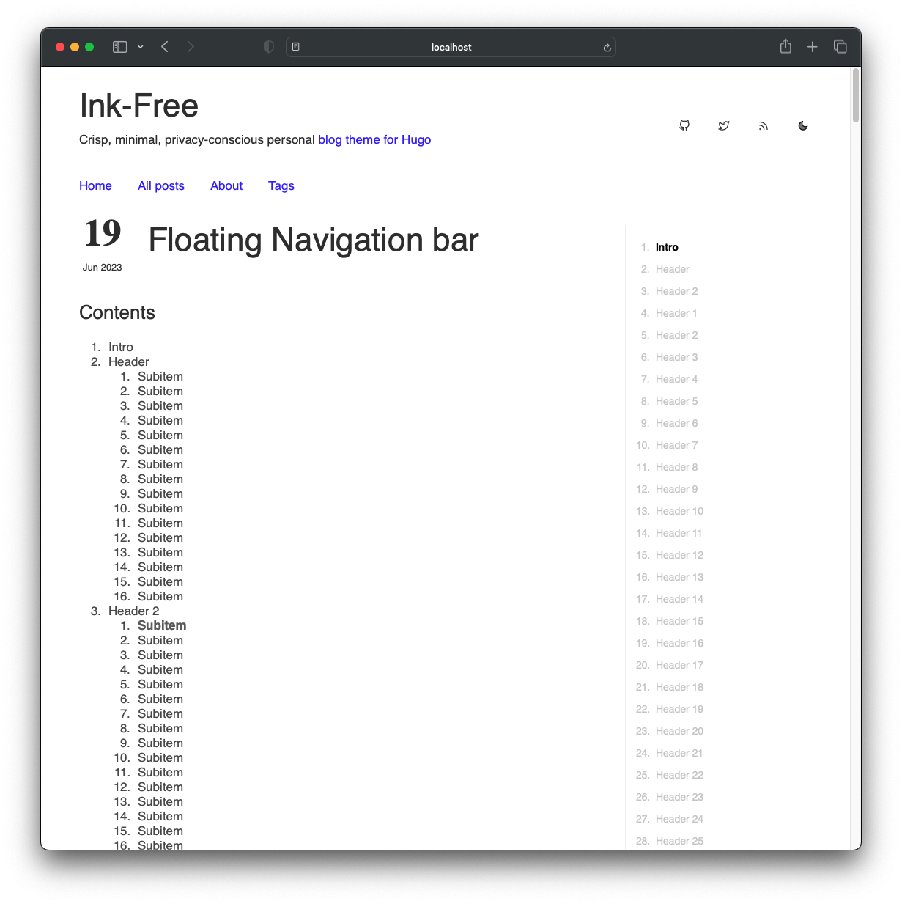
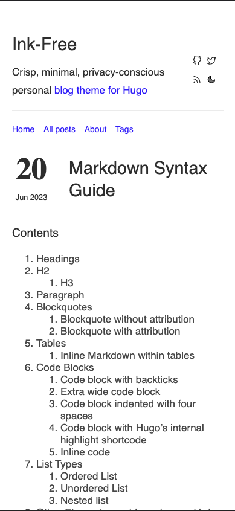

# Ink-Free

[](https://chollinger.com/blog) [](https://github.com/gohugoio/hugo/releases/tag/v0.87.0) [](https://opensource.org/licenses/MIT)

Crisp, minimal personal website and blog theme Hugo, designed for a collaborative, open-source, privacy conscious blog.

Forked from [knadh](https://github.com/knadh/hugo-ink) with custom adjustments. Originally forked from [Ezhil](https://github.com/vividvilla/ezhil).


## Ink-Free vs Hugo-Ink
This repository is a purely local (i.e., no CDNs[^1]), simplified version of `hugo-ink` with several **simplifications** for the sake of privacy:
- Removed all references to Google's font-CDN
- Removed Analytics code, even if it was controlled by a variable

As well as some additional **features**:
- Added a Back button to all posts
- Added a Table of Contents (TOC), controlled by a variable, to all posts
  - The TOC can either be static at the top
  - Or floating on the side

- Added a word count, tags, and an approximate read time to the overview
- Added random footer messages
- Added "Edit this on GitHub" button
- Added `inlineimg` shortcode to render images (e.g. SVGs) in-line
- Added support for `` syntax for image titles
- Random, somewhat humorous messages at the end of each post

And some **bugfixes**:
- Modified the CSS to
  - Order all tags inline, as opposed to as a list
  - Change the background color for Syntax Highlighting, otherwise we're looking at grey code on a grey background
  - Added some classes for a Back button

## Demo

### Overview





### Table Of Contents Options

#### Floating



#### Static



#### Both



#### Truncated



#### Mobile



### Run the example
```
cd exampleSite
hugo serve  --themesDir ../..
```

## Features
* Syntax highlighting
* RSS feeds
* Custom CSS/JS
* Multilingual months support
* Custom TOC
* In-Line images w/ Titles
* Random footer messages
* "Edit this on GitHub" button
* Word count, tags, and an approximate read time in the overview

## Installation

cd into your hugo site's root directory and:

```sh
cd themes
git submodule add https://github.com/chollinger93/ink-free 
```

For more information read the [official setup guide](https://gohugo.io/overview/installing/) of Hugo.


## Content type

You can specify content type with field `type` in your content. For example static pages can be set as type `page` which are excluded from recent posts and all posts page. You can use site params `mainSections` and `disableDisqusTypes` to control which page types are excluded from recent posts and Disqus comments respectively.

```md
---
title: "About"
date: 2019-04-19T21:37:58+05:30
type: "page"
---

This is some static page where you can write about yourself.
```

## Language Settings for the month

Due to the currently unavailable feature for multilingual dates in ``.Date`` from
Go. It is possible to create a ``month.yaml`` in the data folder of your
Hugo site root directoy. There is also an example file in
``exampleSite/data/``.

```sh
cat > month.yaml << EOF
1: "Jan"
2: "Feb"
3: "Mar"
4: "Apr"
5: "May"
6: "Jun"
7: "Jul"
8: "Aug"
9: "Sep"
10: "Oct"
11: "Nov"
12: "Dec"
EOF
```

## Credits

* [knadh](https://github.com/knadh/hugo-ink), who created hugo-ink
* [Ezhil theme](https://github.com/vividvilla/ezhil) from which Ink was forked


## License
Licensed under the MIT license.

[^1]: Note that the Feather CDN can still be enabled, but you can also host it statically.
